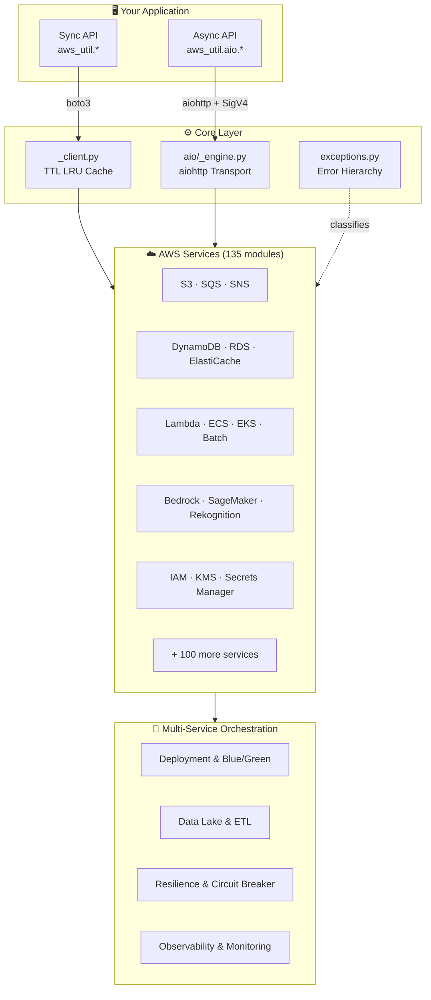
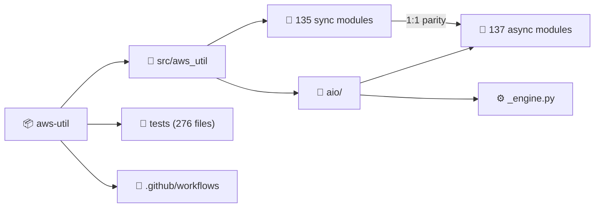
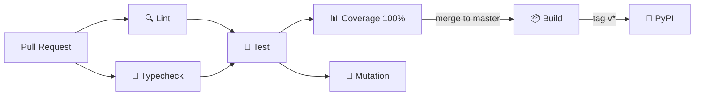

<!-- README auto-maintained. Update this file whenever: code structure changes,
     new env vars added, commands change, new workflows added, or deps updated. -->

<div align="center">

<!-- Animated Author Banner (external SVG so GitHub renders it) -->
<a href="https://www.masrikdahir.com">
  
</a>

**[🌐 masrikdahir.com](https://www.masrikdahir.com)** · **[GitHub](https://github.com/Masrik-Dahir)**

</div>

---

<div align="center">

# 🚀 aws-util

> A comprehensive Python utility library wrapping 100+ AWS services with sync/async parity, Pydantic models, and production-grade error handling.

[](https://github.com/Masrik-Dahir/aws-util-python/actions/workflows/ci.yml)
[](https://github.com/Masrik-Dahir/aws-util-python/actions/workflows/coverage.yml)
[](https://github.com/Masrik-Dahir/aws-util-python/actions/workflows/lint.yml)
[](https://github.com/Masrik-Dahir/aws-util-python/actions/workflows/test.yml)
[](https://github.com/Masrik-Dahir/aws-util-python/actions/workflows/mutation.yml)
[](https://pypi.org/project/aws-util/)
[](https://www.python.org)
[](LICENSE)

</div>

---

## 📋 Table of Contents

- [✨ Features](#-features)
- [🏗️ Architecture](#️-architecture)
- [📁 Project Structure](#-project-structure)
- [⚙️ Prerequisites](#️-prerequisites)
- [🚀 Quick Start](#-quick-start)
- [📖 Usage](#-usage)
- [🔧 Configuration](#-configuration)
- [🧪 Testing](#-testing)
- [🔄 CI/CD](#-cicd)
- [📝 Changelog](#-changelog)
- [🤝 Contributing](#-contributing)
- [📄 License](#-license)

---

## ✨ Features

- 🌐 **135 Service Modules** — Typed wrappers for S3, SQS, DynamoDB, Lambda, Bedrock, ECS, and 100+ more AWS services with 7,300+ method wrappers
- ⚡ **Full Async Parity** — Every sync function has a native `async def` counterpart in `aws_util.aio.*` using a custom aiohttp engine (no monkey-patching)
- 🛡️ **Structured Exception Hierarchy** — `AwsThrottlingError`, `AwsNotFoundError`, `AwsPermissionError`, etc. replace generic `RuntimeError` while staying backward-compatible
- 📦 **Pydantic Result Models** — Every API response is returned as an immutable `BaseModel`, not a raw dict
- 🔄 **TTL Client Cache** — Bounded LRU cache (64 entries, 15-min TTL) auto-rotates STS credentials in long-running processes
- 🔌 **Multi-Service Orchestration** — Pre-built modules for blue/green deployments, data lake management, cross-account operations, disaster recovery, and CI/CD pipelines
- 🛠️ **Lambda Middleware** — Idempotency, batch processing, timeout guards, cold-start tracking, and feature flags out of the box
- 🔐 **Security & Compliance** — Least-privilege analysis, secret rotation, data masking, VPC auditing, WAF management, and compliance snapshots
- 📊 **Observability** — Structured logging, X-Ray tracing, EMF metrics, CloudWatch alarms, and automated dashboard generation

---

## 🏗️ Architecture



---

## 📁 Project Structure

```
📦 aws-util/
├── 📁 src/aws_util/              # 138 sync modules
│   ├── 🔑 __init__.py            # Top-level convenience imports
│   ├── ⚙️ _client.py             # TTL-aware boto3 client factory
│   ├── 🚨 exceptions.py          # Structured error hierarchy
│   ├── 📁 aio/                   # 137 async counterparts
│   │   ├── ⚙️ _engine.py         # Native aiohttp async engine
│   │   └── 📄 *.py               # One async module per service
│   ├── 📄 s3.py                   # S3 operations
│   ├── 📄 dynamodb.py             # DynamoDB operations
│   ├── 📄 lambda_.py              # Lambda management
│   ├── 📄 bedrock.py              # Bedrock AI services
│   ├── 📄 blue_green.py           # Blue/green deployments
│   ├── 📄 data_lake.py            # Data lake management
│   ├── 📄 observability.py        # Monitoring & logging
│   └── 📄 ... (125+ more)        # All other service modules
├── 📁 tests/                      # 276 test files, 100% coverage
├── 📁 .github/workflows/          # 20 CI/CD workflows
├── ⚙️ pyproject.toml              # Build config & task runner
├── ⚙️ Pipfile                     # Dependency management
└── 📖 README.md
```



---

## ⚙️ Prerequisites

Before you begin, make sure you have the following installed:

| Tool | Version | Install |
|------|---------|---------|
| Python | ≥ 3.10 | [python.org](https://www.python.org) |
| pip | ≥ 21.x | Comes with Python |
| pipenv | Latest | `pip install pipenv` |
| AWS CLI | ≥ 2.x | [aws.amazon.com/cli](https://aws.amazon.com/cli/) |
| taskipy | Latest | Installed via dev deps |

> 💡 **Tip:** Configure AWS credentials via `aws configure` or environment variables (`AWS_ACCESS_KEY_ID`, `AWS_SECRET_ACCESS_KEY`, `AWS_DEFAULT_REGION`).

---

## 🚀 Quick Start

### 1. Clone the repository

```bash
git clone https://github.com/Masrik-Dahir/aws-util-python.git
cd aws-util-python
```

### 2. Install dependencies

```bash
pip install -e .[dev]
# Or with pipenv:
PIPENV_IGNORE_VIRTUALENVS=1 pipenv install --dev
```

### 3. Install from PyPI (library usage)

```bash
pip install aws-util
```

### 4. Use it — Sync

```python
from aws_util.s3 import upload_file, download_bytes, list_objects
from aws_util.dynamodb import get_item, put_item
from aws_util.sqs import send_message, receive_messages

# Upload a file to S3
upload_file("my-bucket", "data/report.csv", "/tmp/report.csv")

# Query DynamoDB
item = get_item("users-table", {"pk": "user#123"})

# Send an SQS message
send_message("my-queue", {"event": "order.placed", "id": "abc"})
```

### 5. Use it — Async

```python
from aws_util.aio.s3 import upload_file, download_bytes
from aws_util.aio.dynamodb import get_item, put_item

async def main():
    await upload_file("my-bucket", "key.csv", "/tmp/data.csv")
    item = await get_item("users-table", {"pk": "user#123"})
```

---

## 📖 Usage

### Placeholder Resolution (SSM + Secrets Manager)

```python
from aws_util import retrieve

# Resolves SSM parameters and Secrets Manager secrets
db_url = retrieve("{{ssm:/prod/db/url}}")
api_key = retrieve("{{secret:prod/api-key}}")
```

### Multi-Service Orchestration

```python
from aws_util.deployer import deploy_lambda_with_config, deploy_ecs_from_ecr
from aws_util.data_pipeline import run_glue_then_query, export_query_to_s3_json
from aws_util.security_ops import audit_public_s3_buckets, rotate_iam_access_key
from aws_util.blue_green import ecs_blue_green_deployer
```

### Lambda Middleware

```python
from aws_util.lambda_middleware import (
    idempotent_handler, batch_processor, middleware_chain,
    lambda_timeout_guard, cold_start_tracker, lambda_response,
)
```

### Event-Driven Orchestration

```python
from aws_util.event_orchestration import (
    create_eventbridge_rule, saga_orchestrator, fan_out_fan_in,
    create_schedule, run_workflow,
)
```

### Resilience & Error Handling

```python
from aws_util.resilience import circuit_breaker, retry_with_backoff, dlq_monitor_and_alert
from aws_util.exceptions import AwsThrottlingError, AwsNotFoundError

try:
    item = get_item("table", {"pk": "key"})
except AwsNotFoundError:
    print("Resource not found")
except AwsThrottlingError:
    print("Rate limited — retrying")
```

### Observability

```python
from aws_util.observability import (
    StructuredLogger, create_xray_trace, emit_emf_metric,
    create_lambda_alarms, generate_lambda_dashboard,
)
```

### Security & Compliance

```python
from aws_util.security_compliance import (
    least_privilege_analyzer, secret_rotation_orchestrator,
    data_masking_processor, compliance_snapshot,
)
```

### Cost Optimization

```python
from aws_util.cost_optimization import (
    lambda_right_sizer, unused_resource_finder,
    concurrency_optimizer, cost_attribution_tagger,
)
```

### AI/ML Pipelines

```python
from aws_util.ai_ml_pipelines import (
    bedrock_serverless_chain, s3_document_processor,
    image_moderation_pipeline, translation_pipeline,
)
```

### All 135 Service Modules

<details>
<summary>Click to expand full module list</summary>

| Category | Modules |
|----------|---------|
| **Storage** | `s3`, `efs`, `fsx`, `storage_gateway` |
| **Database** | `dynamodb`, `rds`, `rds_data`, `documentdb`, `elasticache`, `memorydb`, `neptune`, `neptune_graph`, `redshift`, `redshift_data`, `redshift_serverless`, `keyspaces`, `timestream_write`, `timestream_query` |
| **Compute** | `lambda_`, `ecs`, `ecr`, `ec2`, `eks`, `batch`, `app_runner`, `autoscaling`, `elastic_beanstalk`, `emr`, `emr_containers`, `emr_serverless`, `lightsail` |
| **Messaging** | `sqs`, `sns`, `ses`, `ses_v2`, `eventbridge`, `kinesis`, `firehose`, `msk`, `messaging` |
| **AI/ML** | `bedrock`, `bedrock_agent`, `bedrock_agent_runtime`, `comprehend`, `rekognition`, `textract`, `translate`, `transcribe`, `polly`, `personalize`, `personalize_runtime`, `forecast`, `forecast_query`, `sagemaker_runtime`, `sagemaker_featurestore_runtime`, `lex_models`, `lex_runtime` |
| **Security** | `iam`, `kms`, `secrets_manager`, `cognito`, `cognito_identity`, `access_analyzer`, `detective`, `inspector`, `macie`, `security_hub`, `sso_admin` |
| **Networking** | `route53`, `acm`, `cloudfront`, `elbv2`, `vpc_lattice` |
| **Management** | `cloudwatch`, `cloudtrail`, `cloudformation`, `config_service`, `organizations`, `health`, `service_quotas` |
| **Developer Tools** | `codebuild`, `codecommit`, `codedeploy`, `codepipeline`, `codeartifact`, `codestar_connections` |
| **Analytics** | `athena`, `glue`, `databrew`, `quicksight`, `kinesis_analytics` |
| **IoT** | `iot`, `iot_data`, `iot_greengrass`, `iot_sitewise` |
| **Media** | `connect`, `ivs`, `mediaconvert` |
| **Migration** | `dms`, `transfer` |
| **Orchestration** | `stepfunctions`, `event_orchestration`, `data_flow_etl`, `data_pipeline`, `blue_green`, `deployer`, `deployment`, `disaster_recovery`, `container_ops`, `ml_pipeline`, `networking`, `cross_account`, `data_lake`, `database_migration`, `credential_rotation`, `cost_governance`, `cost_optimization`, `security_automation`, `security_compliance`, `security_ops`, `infra_automation`, `resilience`, `observability`, `resource_ops`, `config_loader`, `config_state`, `event_patterns`, `lambda_middleware`, `api_gateway`, `notifier`, `messaging`, `ai_ml_pipelines`, `testing_dev` |
| **Core** | `_client`, `exceptions`, `placeholder`, `parameter_store`, `sts` |

</details>

---

## 🔧 Configuration

| Variable | Required | Default | Description |
|----------|----------|---------|-------------|
| `AWS_ACCESS_KEY_ID` | ✅ | — | AWS access key |
| `AWS_SECRET_ACCESS_KEY` | ✅ | — | AWS secret key |
| `AWS_DEFAULT_REGION` | ❌ | `us-east-1` | Default AWS region |
| `AWS_SESSION_TOKEN` | ❌ | — | Session token for temporary credentials |

The library uses boto3's standard credential chain. Credentials can also come from IAM roles, instance profiles, SSO, or environment variables.

---

## 🧪 Testing

```bash
# Run all tests
task test

# Run tests with coverage report
task test-cov

# Run mutation testing
task mutation-test

# Run coverage with 100% enforcement
task coverage

# Lint and format
task lint

# Type checking
task typecheck

# Full pre-release check (lint + test + coverage + typecheck)
task prepare
```

### Test Stats

| Metric | Value |
|--------|-------|
| Test files | 276 |
| Coverage target | 100% |
| Async test support | `asyncio_mode = "auto"` |
| Mocking framework | moto (S3, SQS, SNS, DynamoDB, Lambda, and more) |

---

## 🔄 CI/CD

This project uses **20 GitHub Actions workflows** for comprehensive automation.

| Workflow | Trigger | Purpose |
|----------|---------|---------|
| `ci.yml` | Push / PR | Full lint + test + typecheck pipeline |
| `test.yml` | Push / PR | Run pytest suite |
| `coverage.yml` | Push / PR | Enforce 100% code coverage |
| `mutation.yml` | Push / PR | Mutation testing with pytest-gremlins |
| `lint.yml` | Push / PR | Ruff linting and formatting |
| `typecheck.yml` | Push / PR | mypy static type checking |
| `build.yml` | Push / PR | Build package artifacts |
| `publish.yml` | Tags / Release | Publish to PyPI |
| `codeql.yml` | Push / PR / Schedule | CodeQL security analysis |
| `security-scan.yml` | Push / PR | Security vulnerability scanning |
| `dependency-review.yml` | PR | Review dependency changes |
| `version-check.yml` | PR | Verify version bump |
| `changelog.yml` | PR | Validate changelog entries |
| `pr-size.yml` | PR | Label PRs by size |
| `label-pr.yml` | PR | Auto-label PRs by file paths |
| `release-drafter.yml` | Push to master | Draft release notes |
| `stale.yml` | Schedule | Close stale issues/PRs |
| `lock-threads.yml` | Schedule | Lock old threads |
| `issue-triage.yml` | Issues | Auto-triage new issues |
| `welcome.yml` | PR / Issue | Welcome new contributors |

### Pipeline Flow



> All checks must pass before merging. See [`.github/workflows/`](.github/workflows/) for full configuration.

---

## 📝 Changelog

| Version | Date | Highlights |
|---------|------|------------|
| v2.2.7 | 2026-04-09 | Scoped CI to S3 module for faster test runs |
| v2.2.6 | 2026-04-08 | 6,189 new boto3 method wrappers (7,303 total), 7,682 new tests |
| v2.2.5 | 2026-04-07 | 71 new service modules (135 total), covering 100+ AWS services |
| v2.0.0 | 2026-03-31 | Structured exceptions, native async engine, 64 modules, TTL client cache |

See [`CHANGELOG.md`](CHANGELOG.md) for the full history.

---

## 🤝 Contributing

Contributions are welcome! Please follow these steps:

1. **Fork** the repository
2. **Create** a feature branch: `git checkout -b feat/amazing-feature`
3. **Commit** your changes: `git commit -m 'feat: add amazing feature'`
4. **Push** to the branch: `git push origin feat/amazing-feature`
5. **Open** a Pull Request

### Development Setup

```bash
git clone https://github.com/Masrik-Dahir/aws-util-python.git
cd aws-util-python
pip install -e .[dev]
task prepare   # lint + test + coverage + typecheck
```

### Commit Convention

This project uses [Conventional Commits](https://www.conventionalcommits.org/):

| Prefix | Use for |
|--------|---------|
| `feat:` | New features |
| `fix:` | Bug fixes |
| `docs:` | Documentation only |
| `chore:` | Build / tooling changes |
| `test:` | Adding or fixing tests |

> Please ensure all tests pass and coverage stays at 100% before opening a PR.

---

## 📄 License

Distributed under the MIT License. See [`LICENSE`](LICENSE) for more information.

---

<div align="center">

Made with ❤️ by **[Masrik Dahir](https://www.masrikdahir.com)**

⭐ Star this repo if you find it helpful!

</div>
