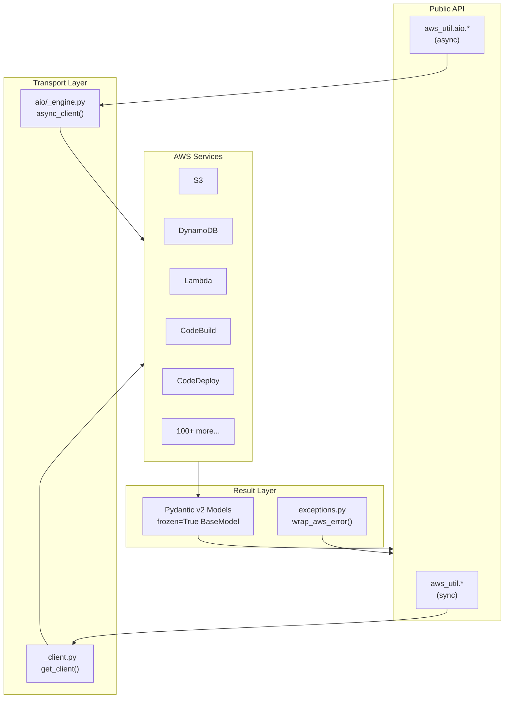
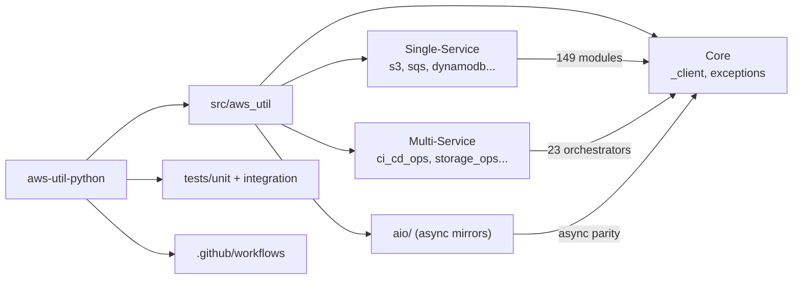
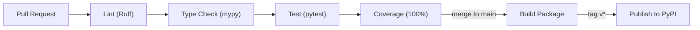

<!-- README auto-maintained. Update this file whenever: code structure changes,
     new env vars added, commands change, new workflows added, or deps updated. -->

<div align="center">

*— project —*

<!-- Project Banner: test-coverage-matrix -->
<a href="https://www.masrikdahir.com">

</a>

*— author —*

<!-- Author Banner: harmonic-pendulum-wave -->
<a href="https://www.masrikdahir.com">

</a>

> Production-grade Python wrappers for 100+ AWS services with typed Pydantic results, native async, and multi-service orchestration in a single call

[](https://badge.fury.io/py/aws-util)
[](https://www.python.org)
[](LICENSE)
[](https://github.com/Masrik-Dahir/aws-util-python/actions/workflows/ci.yml)
[](https://codecov.io/gh/Masrik-Dahir/aws-util-python)
[](https://github.com/astral-sh/ruff)
[](https://mypy-lang.org/)

</div>

---

<p align="center">
  
</p>

---

## TL;DR

- **What:** A Python library that wraps every major AWS API surface (149 modules, 7,800+ methods) with typed Pydantic v2 return values and structured error handling.
- **Who:** Backend and DevOps engineers who use boto3 daily and want to stop writing the same try/except/parse boilerplate across projects.
- **Why:** Unlike raw boto3, every call returns a frozen Pydantic model instead of a raw dict — no silent key typos, full IDE autocomplete, and multi-service orchestrations that combine 2-5 AWS calls into one function.
- **Start:** `pip install aws-util` then `from aws_util.s3 import upload_file` — credentials come from your existing AWS config; no setup beyond that.
- **Know:** Requires Python 3.10+ and Pydantic v2; the async engine (`aws_util.aio.*`) mirrors every sync function but needs `aiohttp>=3.9`.

---

## Table of Contents

- [TL;DR](#tldr)
- [Features](#features)
- [Architecture](#architecture)
- [Project Structure](#project-structure)
- [Prerequisites](#prerequisites)
- [Quick Start](#quick-start)
- [Configuration](#configuration)
- [Module Reference](#module-reference)
- [Multi-Service Orchestration](#multi-service-orchestration)
- [Async Usage](#async-usage)
- [Testing](#testing)
- [CI / CD](#ci--cd)
- [Contributing](#contributing)
- [License](#license)
- [Changelog](#changelog)

---

## Features

### Core Services

Individual wrappers for every major AWS service — typed, tested, and ready to drop in:

| Category | Modules |
|---|---|
| Compute | `ec2`, `lambda_`, `ecs`, `eks`, `batch`, `elastic_beanstalk`, `app_runner`, `autoscaling` |
| Storage | `s3`, `efs`, `fsx`, `storage_gateway`, `lightsail`, `transfer`, `datasync` *(via storage_ops)* |
| Databases | `dynamodb`, `rds`, `rds_data`, `redshift`, `redshift_data`, `redshift_serverless`, `documentdb`, `neptune`, `neptune_graph`, `memorydb`, `elasticache`, `keyspaces`, `timestream_write`, `timestream_query` |
| Messaging & Eventing | `sqs`, `sns`, `eventbridge`, `kinesis`, `firehose`, `msk`, `ivs` |
| AI / ML | `bedrock`, `bedrock_agent`, `bedrock_agent_runtime`, `rekognition`, `textract`, `comprehend`, `translate`, `polly`, `transcribe`, `forecast`, `forecast_query`, `personalize`, `personalize_runtime`, `sagemaker_runtime`, `sagemaker_featurestore_runtime`, `lex_models`, `lex_runtime` |
| Security | `iam`, `kms`, `secrets_manager`, `cognito`, `cognito_identity`, `acm`, `inspector`, `macie`, `detective`, `security_hub`, `sso_admin`, `access_analyzer` |
| Networking | `route53`, `cloudfront`, `elbv2`, `vpc_lattice`, `api_gateway`, `api_gateway_ops` |
| Developer Tools | `codebuild`, `codedeploy`, `codepipeline`, `codecommit`, `codeartifact`, `codestar_connections` |
| Observability | `cloudwatch`, `cloudtrail`, `health`, `observability`, `config_service`, `config_state` |
| Governance | `organizations`, `service_quotas`, `cost_governance`, `cost_optimization` |
| Data & Analytics | `glue`, `athena`, `databrew`, `emr`, `emr_containers`, `emr_serverless`, `kinesis_analytics`, `quicksight`, `dms`, `iot_sitewise` |
| IoT | `iot`, `iot_data`, `iot_greengrass` |
| Serverless / Integrations | `stepfunctions`, `parameter_store`, `config_loader`, `ses`, `ses_v2`, `connect`, `mediaconvert` |

### Multi-Service Orchestration Modules

Higher-order modules that combine multiple AWS services into end-to-end workflows:

| Module | What it does |
|---|---|
| `api_gateway_ops` | WebSocket sessions, JWT Lambda authorizers, usage plan enforcement, rate limiting, domain migration |
| `iot_pipelines` | IoT telemetry to Timestream, device shadow sync, fleet command broadcast, SiteWise alerts, Greengrass deploys |
| `contact_center_ops` | Connect contact event to DynamoDB, post-call analysis (Transcribe + Comprehend), Lex escalation |
| `media_processing` | IVS stream archival, MediaConvert job orchestration |
| `cache_ops` | ElastiCache warming from DynamoDB, DynamoDB Streams invalidation, MemoryDB snapshot to S3 |
| `ci_cd_ops` | CodeBuild-triggered deploy, CodePipeline approval notifier, PR-to-CodeBuild, CodeArtifact package promotion |
| `storage_ops` | EFS-to-S3 DataSync, FSx backup archival, Transfer Family event processing, Storage Gateway monitoring, Lightsail snapshot export |
| `governance` | Config rule remediation, SCP drift detection, SSO permission set auditing, KMS key rotation auditing |
| `finding_ops` | Inspector-to-Jira, Macie remediation, Detective graph export, Security Hub routing, CloudTrail anomaly detection, Access Analyzer suppression |
| `analytics_pipelines` | Redshift unload/serverless queries, QuickSight embedding/refresh, Athena-to-DynamoDB, Glue crawlers, EMR Serverless, Timestream/Neptune queries, ELB log analysis, OpenSearch lifecycle |
| `security_ops` | Cognito group sync, CloudFront signed URLs, WAF IP blocklist, Shield protection, ACM certificate monitoring, Cognito token enrichment |
| `cost_optimization` | Trusted Advisor reports, Cost & Usage analysis, Savings Plan coverage, idle EC2/RDS cleanup, ECR lifecycle, S3 tiering, Lambda dead code detection |
| `ai_ml_pipelines` | Rekognition face/video, Polly audio, Transcribe, Comprehend PII, Textract forms, Bedrock knowledge base/guardrails, Personalize, Forecast, SageMaker batch |
| `deployment` | CloudFront invalidation, Elastic Beanstalk refresh, App Runner auto-deploy, EKS node scaling/config, Batch monitoring, autoscaling actions, Step Functions tracking |
| `networking` | VPC Lattice registration, Transit Gateway route auditing, Route 53 health checks, EventBridge cross-account forwarding |
| `observability` | Kinesis Analytics alarms, DMS task monitoring, Health events to Teams, service quota monitoring |
| `resilience` | Distributed lock manager (DynamoDB-based) |
| `config_loader` | AppConfig feature flags, cross-region parameter replication |
| `data_flow_etl` | MSK-to-S3 archival, MSK schema enforcement, DocumentDB change streams to SQS, Neptune graph backup, Keyspaces TTL enforcement |
| `resource_ops` | SES suppression list management, SQS DLQ reprocessing, cross-account S3 copy |
| `deployer` | Deploy Lambda + ECS + Fargate with config injection |
| `notifier` | Multi-channel alert (SNS + SES + Slack webhook) with retry |
| `data_pipeline` | Glue to Athena to S3 export pipelines |

---

## Architecture



**Data flow:**
1. Caller invokes a function from `aws_util.*` or `aws_util.aio.*`
2. The sync path calls `get_client(service, region)` which returns a `boto3` client
3. The async path calls `async_client(service, region)` which returns an async-capable client proxy
4. AWS response is validated and packed into a frozen Pydantic model
5. `ClientError` / `RuntimeError` is caught and re-raised via `wrap_aws_error()` for consistent error handling

---

## Project Structure

```
aws-util-python/
├── src/
│   └── aws_util/                # Sync public API (149 modules)
│       ├── __init__.py
│       ├── _client.py           # boto3 client factory (get_client)
│       ├── exceptions.py        # AwsUtilError hierarchy + wrap_aws_error
│       ├── py.typed             # PEP 561 type marker
│       ├── s3.py                # example single-service module
│       ├── ci_cd_ops.py         # multi-service CI/CD orchestration
│       ├── storage_ops.py       # multi-service storage orchestration
│       ├── analytics_pipelines.py
│       ├── ai_ml_pipelines.py
│       ├── iot_pipelines.py
│       └── aio/                 # Async public API (mirrors sync)
│           ├── __init__.py
│           ├── _engine.py       # async boto3 client factory (async_client)
│           ├── s3.py
│           ├── ci_cd_ops.py
│           └── ... (147 async modules)
├── tests/
│   ├── unit/
│   │   ├── conftest.py          # moto fixtures, shared mocks
│   │   ├── test_s3.py           # sync module tests
│   │   ├── test_aio_s3.py       # async module tests
│   │   └── ...                  # 284+ unit test files
│   └── integration/
│       ├── conftest.py          # LocalStack fixtures
│       ├── test_integ_*.py      # 21 integration test files
│       └── ...                  # 212 integration tests
├── pyproject.toml               # Project metadata + tool config
├── Pipfile                      # Pipenv dependency spec
├── requirements.txt             # Generated from Pipfile.lock
└── CHANGELOG.md
```



---

## Prerequisites

| Requirement | Minimum version | Notes |
|---|---|---|
| Python | 3.10 | 3.12 recommended |
| boto3 | latest | Pulled automatically |
| Pydantic | >= 2.0 | v2 required, v1 not supported |
| AWS credentials | — | Any credential source boto3 supports |
| pipenv | any | For development installs |

---

## Quick Start

### Install from PyPI

```bash
pip install aws-util
```

### Single-service usage

```python
from aws_util.s3 import upload_file, download_bytes
from aws_util.sqs import send_message, receive_messages
from aws_util.dynamodb import get_item, put_item

# Upload a file to S3
result = upload_file("my-bucket", "data/report.csv", "/tmp/report.csv")
print(result.etag)

# Receive messages from SQS
msgs = receive_messages("https://sqs.us-east-1.amazonaws.com/123/my-queue", max_messages=5)
for msg in msgs:
    print(msg.body)
```

### Multi-service orchestration

```python
from aws_util.ci_cd_ops import codebuild_triggered_deploy
from aws_util.storage_ops import efs_to_s3_sync

# Trigger a CodeBuild build, wait for success, then deploy via CodeDeploy
result = codebuild_triggered_deploy(
    project_name="my-build-project",
    source_bucket="my-artifacts",
    source_key="builds/app.zip",
    application_name="my-app",
    deployment_group_name="prod-group",
)
print(result.build_status, result.deployment_status)
# CIDeployResult(build_id='...', build_status='SUCCEEDED', deployment_id='d-XXXX', deployment_status='Succeeded')

# Sync an EFS filesystem to S3 via DataSync
sync_result = efs_to_s3_sync(
    efs_filesystem_id="fs-abc123",
    source_subnet_arn="arn:aws:ec2:us-east-1:123456789:subnet/subnet-abc",
    source_security_group_arns=["arn:aws:ec2:us-east-1:123456789:security-group/sg-abc"],
    bucket="my-backup-bucket",
    key_prefix="efs-backups",
    table_name="sync-audit-log",
)
print(sync_result.task_arn, sync_result.status)
```

### Load application config

```python
from aws_util.config_loader import load_app_config

config = load_app_config(
    ssm_path="/myapp/prod/",
    secret_ids=["myapp/prod/db-credentials"],
    region_name="us-east-1",
)
# config.parameters: dict[str, str]   -- SSM values
# config.secrets: dict[str, Any]      -- Secrets Manager values
```

### Lambda middleware

```python
from aws_util.lambda_middleware import idempotent_handler

@idempotent_handler(table_name="idempotency-table")
def handler(event, context):
    # This function body runs at most once per unique event
    return process(event)
```

---

## Configuration

`aws-util` uses boto3 under the hood and therefore respects all standard AWS credential providers:

| Provider | How to configure |
|---|---|
| Environment variables | `AWS_ACCESS_KEY_ID`, `AWS_SECRET_ACCESS_KEY`, `AWS_DEFAULT_REGION` |
| AWS config file | `~/.aws/credentials` and `~/.aws/config` |
| IAM role (EC2/ECS/Lambda) | Automatic — no configuration needed |
| STS assume role | Pass a pre-configured session to `get_client()` |

### Region override

Every function accepts an optional `region_name` parameter:

```python
from aws_util.s3 import list_buckets

buckets = list_buckets(region_name="eu-west-1")
```

### Custom boto3 session

```python
import boto3
from aws_util._client import get_client

session = boto3.Session(profile_name="staging", region_name="ap-southeast-1")
client = get_client("s3", region_name="ap-southeast-1", session=session)
```

---

## Module Reference

### `ci_cd_ops` — CI/CD Orchestration

```python
from aws_util.ci_cd_ops import (
    codebuild_triggered_deploy,
    codepipeline_approval_notifier,
    codecommit_pr_to_codebuild,
    codeartifact_package_promoter,
)
```

| Function | Services | Description |
|---|---|---|
| `codebuild_triggered_deploy` | CodeBuild, CodeDeploy | Start a build from S3, poll to completion, then create a deployment |
| `codepipeline_approval_notifier` | CodePipeline, SES v2, DynamoDB | Find pending approval actions, email approvers, persist tokens |
| `codecommit_pr_to_codebuild` | CodeCommit, CodeBuild | Trigger a build for a PR's source ref, post build status as a PR comment |
| `codeartifact_package_promoter` | CodeArtifact, SSM | Copy a package version between repositories, update an SSM version manifest |

**Result models:**

```python
CIDeployResult(build_id, build_status, deployment_id, deployment_status)
ApprovalNotifyResult(pending_approvals, emails_sent, approval_tokens: list[str])
PRBuildResult(build_id, build_status, comment_id)
PackagePromoteResult(package_name, version, promoted: bool, ssm_updated: bool)
```

### `storage_ops` — Storage Orchestration

```python
from aws_util.storage_ops import (
    efs_to_s3_sync,
    fsx_backup_to_s3,
    transfer_family_event_processor,
    storage_gateway_cache_monitor,
    lightsail_snapshot_to_s3,
)
```

| Function | Services | Description |
|---|---|---|
| `efs_to_s3_sync` | DataSync, S3, DynamoDB | Create DataSync task to sync EFS to S3, log execution to DynamoDB |
| `fsx_backup_to_s3` | FSx, S3 | Initiate FSx backup, poll to AVAILABLE, write JSON metadata to S3 |
| `transfer_family_event_processor` | Transfer Family (S3), SNS | Process new uploads: validate, version-copy, delete source, notify via SNS |
| `storage_gateway_cache_monitor` | Storage Gateway, CloudWatch | Measure cache utilisation; create CloudWatch alarm if above threshold |
| `lightsail_snapshot_to_s3` | Lightsail, S3 | Create Lightsail instance snapshot, wait for availability, export, archive metadata |

**Result models:**

```python
EfsS3SyncResult(task_arn, execution_arn, status)
FsxBackupResult(backup_id, status, s3_metadata_key)
TransferEventResult(files_processed, files_moved: list[str], notifications_sent)
CacheMonitorResult(gateway_id, cache_used_percent, cache_allocated_bytes, alarm_created: bool)
LightsailExportResult(snapshot_name, export_arn: str | None, s3_metadata_key)
```

### Error Handling

All functions raise `aws_util.exceptions.AwsUtilError` (a subclass of `Exception`) on failure:

```python
from aws_util.exceptions import AwsUtilError
from aws_util.s3 import download_bytes

try:
    data = download_bytes("my-bucket", "missing-key.txt")
except AwsUtilError as exc:
    print(exc.service, exc.operation, exc.message)
```

---

## Multi-Service Orchestration

### Deployer

```python
from aws_util.deployer import deploy_lambda_with_config, deploy_ecs_from_ecr

# Deploy a Lambda function, loading config from SSM + Secrets Manager
result = deploy_lambda_with_config(
    function_name="my-function",
    s3_bucket="deploy-artifacts",
    s3_key="builds/v1.2.3.zip",
    ssm_config_path="/myapp/prod/",
    secret_ids=["myapp/prod/db"],
)
print(result.function_arn, result.config_keys_injected)
```

### Notifier

```python
from aws_util.notifier import send_alert, notify_on_exception

# Send a multi-channel alert
send_alert(
    subject="Deploy failed",
    message="Stage: production, Error: timeout",
    sns_topic_arn="arn:aws:sns:us-east-1:123:alerts",
    from_email="alerts@example.com",
    to_emails=["ops@example.com"],
)

# Wrap any function -- alert on exception
@notify_on_exception(sns_topic_arn="arn:aws:sns:us-east-1:123:alerts")
def critical_job():
    ...
```

### Security Ops

```python
from aws_util.security_ops import audit_public_s3_buckets, rotate_iam_access_key

# Audit all S3 buckets for public access -- returns list of findings
findings = audit_public_s3_buckets(region_name="us-east-1")
for f in findings:
    print(f.bucket_name, f.public_read, f.public_write)

# Rotate an IAM access key
result = rotate_iam_access_key(username="deploy-bot", ssm_path="/myapp/prod/access-key")
print(result.new_access_key_id, result.ssm_keys_updated)
```

---

## Async Usage

Every public sync function has an async counterpart in `aws_util.aio.*`:

```python
import asyncio
from aws_util.aio.ci_cd_ops import codebuild_triggered_deploy
from aws_util.aio.storage_ops import efs_to_s3_sync

async def main():
    # Run CI/CD deploy and EFS sync concurrently
    deploy_result, sync_result = await asyncio.gather(
        codebuild_triggered_deploy(
            project_name="my-build",
            source_bucket="artifacts",
            source_key="builds/app.zip",
            application_name="my-app",
            deployment_group_name="prod",
        ),
        efs_to_s3_sync(
            efs_filesystem_id="fs-abc123",
            source_subnet_arn="arn:aws:ec2:us-east-1:123:subnet/subnet-abc",
            source_security_group_arns=["arn:aws:ec2:us-east-1:123:security-group/sg-abc"],
            bucket="backups",
            key_prefix="efs",
            table_name="sync-log",
        ),
    )
    print(deploy_result.deployment_status)
    print(sync_result.task_arn)

asyncio.run(main())
```

Async modules use `async_client()` from `aws_util.aio._engine` which wraps boto3 calls in `asyncio.get_event_loop().run_in_executor()` to avoid blocking the event loop.

---

## Testing

### Run the full test suite

```bash
# Install dev dependencies
pipenv install --dev

# Run unit tests
pipenv run pytest tests/unit/ -v

# Run integration tests (requires LocalStack: docker compose up -d)
pipenv run pytest tests/integration/ -v -m integration

# Run all tests
pipenv run pytest tests/ -v

# Run with coverage
pipenv run pytest tests/unit/ -v --cov=src/aws_util --cov-report=term-missing

# Run only async tests
pipenv run pytest tests/unit/ -v -k "aio"

# Run a specific module's tests
pipenv run pytest tests/unit/test_ci_cd_ops.py tests/unit/test_aio_ci_cd_ops.py -v
```

### Mutation testing

```bash
pipenv run pytest tests/unit/ --gremlins
```

### Linting and type checking

```bash
# Lint + format
pipenv run ruff check --fix --unsafe-fixes src/
pipenv run ruff format src/

# Type check
pipenv run mypy src/aws_util/
```

### Using moto for local AWS mocking

All tests use [moto](https://docs.getmoto.org/) to mock AWS services without needing real credentials:

```python
from moto import mock_aws

@mock_aws
def test_upload_file(tmp_path):
    import boto3
    s3 = boto3.client("s3", region_name="us-east-1")
    s3.create_bucket(Bucket="test-bucket")

    from aws_util.s3 import upload_file
    result = upload_file("test-bucket", "key.txt", str(tmp_path / "f.txt"))
    assert result.etag is not None
```

---

## CI / CD

The repository ships with a comprehensive GitHub Actions workflow suite:

| Workflow | Trigger | Purpose |
|---|---|---|
| `ci.yml` | Push / PR | Full test suite across Python 3.10, 3.11, 3.12 |
| `lint.yml` | Push / PR | Ruff lint + format check |
| `typecheck.yml` | Push / PR | mypy strict type checking |
| `coverage.yml` | Push | Coverage report with 100% minimum threshold |
| `test.yml` | Push / PR | Unit tests (scoped to s3 module) |
| `mutation.yml` | Schedule | Mutation testing with pytest-gremlins |
| `build.yml` | Push | Package build verification |
| `publish.yml` | Tag push | PyPI publish on version tag |
| `security-scan.yml` | Push / Schedule | Bandit security scan |
| `codeql.yml` | Push / Schedule | GitHub CodeQL security analysis |
| `release-drafter.yml` | PR merge | Auto-draft GitHub releases |
| `banner-archive.yml` | Banner push | Validate and archive SVG banners |
| `stats.yml` | Push | Repository statistics collection |
| `release-stats.yml` | Release | Release metrics generation |
| `update-badges.yml` | Push | Badge data refresh |

### Pipeline Flow



### Release workflow

```bash
# Bump patch version, build, upload to PyPI
pipenv run task publish

# Bump minor version
pipenv run task publish:minor

# Bump major version
pipenv run task publish:major

# Bump to a specific version
pipenv run task "publish:v" 3.0.0
```

---

## Contributing

1. Fork the repository and create a feature branch
2. Follow the **async parity rule** — every new public sync function needs an `async def` twin in `aws_util/aio/`
3. Write tests using `moto` mocks — both sync (`test_*.py`) and async (`test_aio_*.py`)
4. Run `pipenv run task prepare` — this lints, tests, checks coverage (100% minimum), and type-checks
5. Update `CHANGELOG.md` under `[Unreleased]`
6. Open a pull request — the PR template will guide you through the checklist

### Commit Convention

This project uses [Conventional Commits](https://www.conventionalcommits.org/):

| Prefix | Use for |
|--------|---------|
| `feat:` | New features |
| `fix:` | Bug fixes |
| `docs:` | Documentation only |
| `chore:` | Build / tooling changes |
| `test:` | Adding or fixing tests |

### Adding a new module

```bash
# 1. Create the sync module
touch src/aws_util/my_service.py

# 2. Create the async counterpart
touch src/aws_util/aio/my_service.py

# 3. Add tests
touch tests/unit/test_my_service.py
touch tests/unit/test_aio_my_service.py

# 4. Run the full suite
pipenv run task prepare
```

Module template (sync):

```python
from __future__ import annotations

from botocore.exceptions import ClientError
from pydantic import BaseModel, ConfigDict

from aws_util._client import get_client
from aws_util.exceptions import wrap_aws_error

__all__ = ["MyResult", "my_function"]


class MyResult(BaseModel):
    """Result of my_function."""

    model_config = ConfigDict(frozen=True)

    resource_id: str
    status: str


def my_function(
    resource_name: str,
    *,
    region_name: str = "us-east-1",
) -> MyResult:
    """One-line summary.

    Args:
        resource_name: The name of the resource.
        region_name: AWS region.

    Returns:
        MyResult with resource_id and status.

    Raises:
        AwsUtilError: On any AWS API error.
    """
    client = get_client("my-service", region_name=region_name)
    try:
        resp = client.create_resource(Name=resource_name)
    except ClientError as exc:
        raise wrap_aws_error(exc) from exc
    return MyResult(
        resource_id=resp["ResourceId"],
        status=resp["Status"],
    )
```

---

## License

[MIT](LICENSE) — 2024 [Masrik Dahir](https://www.masrikdahir.com)

---

## Changelog

| Version | Date | Changes |
|---------|------|---------|
| v2.3.0 | 2026-04-16 | 283 unit tests for 17 missing functions across 5 modules (100% function coverage) |
| v2.2.9 | 2026-04-15 | 100 new multi-service orchestration functions across 20 modules |
| v2.2.7 | 2026-04-09 | Scoped CI workflows to s3 module |
| v2.2.6 | 2026-04-08 | 6,189 new boto3 method wrappers (100% API coverage) |
| v2.2.5 | 2026-04-07 | 71 new single-service modules (135 total) |
| v2.0.0 | 2026-03-31 | Structured exceptions, native async engine, 64 modules |

---

<div align="center">

Made with care by **[Masrik Dahir](https://www.masrikdahir.com)**

</div>
